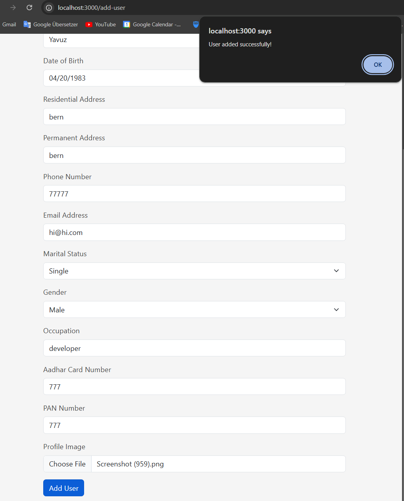

# Personal Info Management System

## Screenshots

### Get Users


### Add User


## Overview
This project is a **Personal Information Management System** built with a React frontend and a .NET Core Web API backend. Users can perform CRUD operations on personal information and upload profile images.

## Features
- Add, update, and delete personal data.
- Fetch all users' data.
- Upload profile images.
- Responsive UI with React.
- API documentation using Swagger.

## Tech Stack
- **Frontend**: React, Axios
- **Backend**: .NET Core Web API
- **Database**: MSSQL Server
- **Others**: Swagger for API docs, Postman for testing.

## Setup Instructions

### Prerequisites
- .NET Core SDK
- Node.js & npm
- SQL Server or any database client

### Database Setup
1. Create a new database.
2. Update the connection string in `appsettings.json`.

### Backend Setup
1. Clone the repository and navigate to the backend folder:
   ```bash
   cd backend
   dotnet restore
   dotnet ef database update
   dotnet run
