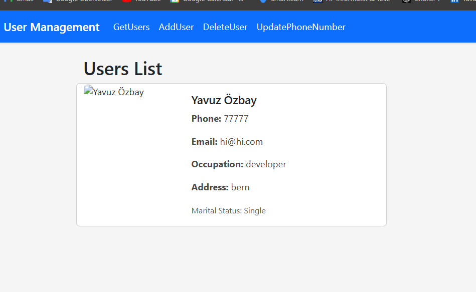

# Personal Info Management System

## Screenshots

### Get Users

### Add User

## Overview
This project is a **Personal Information Management System** built with a React frontend and a .NET Core Web API backend. Users can perform CRUD operations on personal information and upload profile images.

## Features
- Add, update, and delete personal data.
- Fetch all users' data.
- Upload profile images.
- Responsive UI with React.
- API documentation using Swagger.

## Tech Stack
- **Frontend**: React, Axios
- **Backend**: .NET Core Web API
- **Database**: MSSQL Server
- **Others**: Swagger for API docs, Postman for testing.

## Setup Instructions

### Prerequisites
- .NET Core SDK
- Node.js & npm
- SQL Server or any database client

### Database Setup
1. Create a new database.
2. Update the connection string in `appsettings.json`.

### Backend Setup
### Clone the Repository
To clone this project locally, run the following commands:

git clone https://github.com/yavuzoz/.NETCore-React-Fullstack-App.git
cd DotNetBackendAPI

### Install the required dependencies and update the database:

dotnet restore
dotnet ef database update

### Run the backend server:

dotnet run

### Frontend Setup

Navigate to the frontend folder:

cd React-Client

### Install the dependencies:

npm install

### Start the React development server:

npm start

### The frontend will be running on http://localhost:3000 and the backend API will be available on http://localhost:5183.

